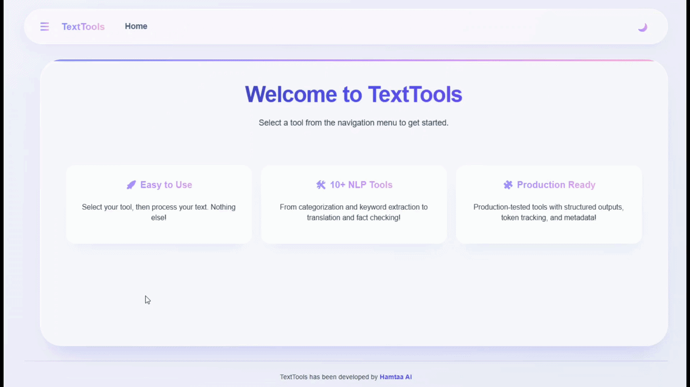

# TextTools Web App

A clean web interface for the TextTools NLP library.

<p align="center">
  
</p>

---

## 🚀 Quick Start

```bash
git clone https://github.com/ErfanMoosavi/texttools-app.git
cd texttools-app
pip install .
# set OPENAI_BASE_URL, OPENAI_API_KEY, MODEL_NAME
uvicorn app.main:app --reload
```

---

## ✨ Features
- 10+ NLP tools: categorize, extract keywords/entities, question ops, augment, summarize, translate, propositionize, fact-check.

- REST API + modern UI with dark mode.

- Structured outputs with metadata.
